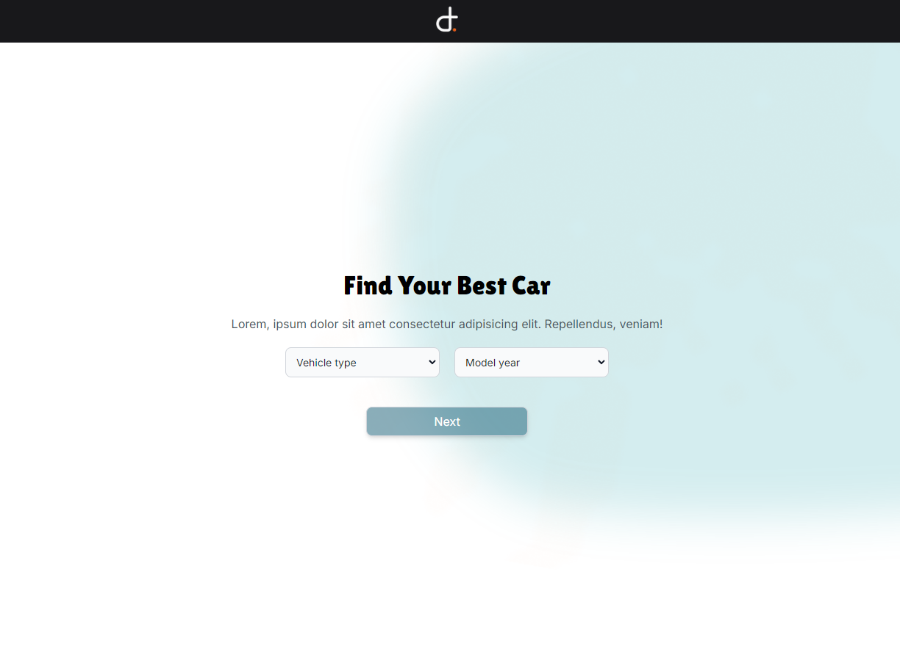
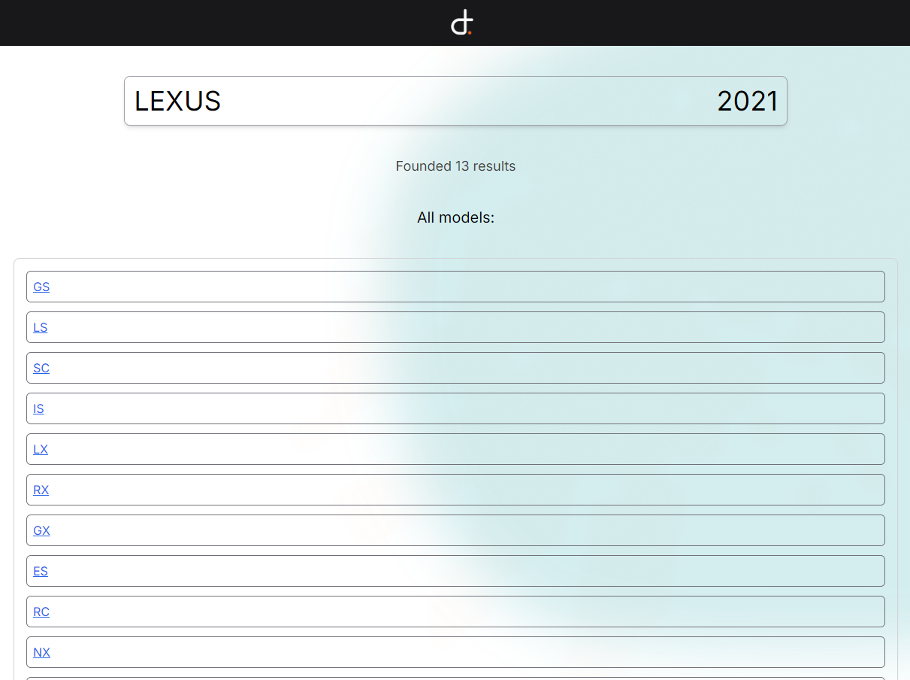

    

# How to run
    1. git clone https://github.com/SchunckLeonardo/develops-today.git

    2. cd develops-today

    3. npm install

    4. npm run dev

# How to build
    1. npm run build

# Overview
### Search your car by the make and year

### Get the results and reach your dreams
